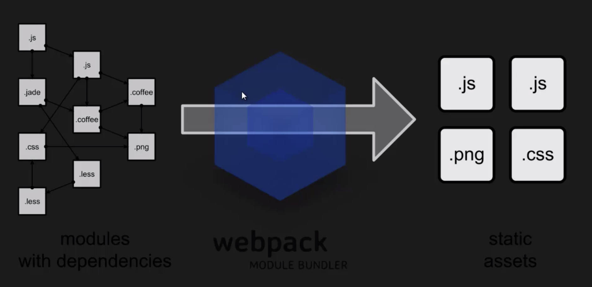

# Webpack (version 2.0)

Webpack - сборщик модулей на проекте. Обычно ваш проект состоит из JS файлов, стилей, шаблонизаторов
и тд. Помимо этого все эти модули переплетены зависимостями и после того, как эти файлы пройдут через
webpack, мы получим просто основные статические сущности, которые правильно разложены по зависимостям.  




## Что предоставляет Webpack

* Поддержка модулей (так же он поддерживает нативный ES6 синтаксис)

    * AMD
    * Common.js
    
* Пакетные мендеджеры (может спокойной подключать различные библиотеки, которые были установлены за
счет данных пакетных менеджеров)

    * NPM
    * Bower
    
* Live Reload (это обновление контента без перезагрузки страницы браузера)

    * Hot Module Replacement (если поменяем JS код, то окно бразера не перезагрузится, а изменения
    будут пременены)


### Какие проблемы решает Webpack

* Правильный порядок скриптов (сам смотрит на зависимости скриптов и подключает в правильно порядке)
* Правильные зависимости подключены
* (на каждой странице)
* Лимит подключения скриптов
* Без использования пакетных менеджеров приходилось копировать исходный код библиотке

### Что такое Webpack

* Webpack инструмент для совмещения модулей, а не таск раннер (как gulp или grunt)

* Анализирует дерево зависимостей (не только JS, но и CSS, картинки, HTML и тд)

* Понимает разные стандарты модулей (Common.js, AMD ...)

* Webpack2 понимает ES6 импорты и экспорты

### Зачем он был разработан

* Разделение кода (декомпозиция) и загрузка модулей по требованию
* Уменьшение скорости загрузки страниц (объединение модулей, минификация)
* Статические сущности (шрифты, картинки) - тоже модули которые можно обрабатывать
* Понимание NodeJS модулей (для работы со сторонними библиотеками)
* Подходит для больших проектов

### Различия

* Может использовать NPM
* У каждого модуля есть свои зависимости, которые Webpack отлично понимает
* Нет глобальных переменных (если мы сами их не создадим)
* Все загружается в нужном порядке (если нет рекурсии)
* Возможность тестирования каждого меодуля отдельно

#### Первый запуск

Установка глобально пакета Webpack и в папке с файлами js можно выполнить webpack init.js -o out.js,
чтобы собрать все файлы в один bundle.

### Командные интерфейсы webpack

В данной команде webpack по дефолту создает файл для продакшена и сразу минифицырует выходной бандл,
чтобы собрать файл для разработки необходимо задать mode development:
```
webpack --mode=development init.js -o out-d.js
```

Для того чтобы войти в режим "вотчинга" за изменениями в файлах js мы так же можем прописать команду
```
webpack init.js -o out-d.js -d --watch
```

Теперь при любых изменениях в файлах, вебпак будет пересобирать данный bundle

#### Source maps

C помощью команды мы можем добавить в модули функцию eval, которая компилирует входящую строку и добавляет
source map (работает с открытой консолью):

```
webpack init.js -o out-d.js -d
```

Подсветка в консоле с помощью команды

```
webpack init.js -o out-d.js --colors
```

### Работа с Webpack config

Для этого необходимо в корне проекта на одном уровне с папкой src создать файл webpack.config.js

Основная особенность данного файла (из-за того что он работает на платформе NodeJS) он должен экспортировать
из себя некий объект, делается это с помощью конструкции module.exports. В NodeJS единичный js файл
является модулем и у него есть глобальный объект module, у которого есть объект exports, в который мы можем положить
объект:

```
module.exports = {}
```

И далее в этом объекте мы будем описывать ключи в синтаксисе JS и значения - конфигурация webpack'а

* Сначала установим точку входа через ключ **entry** - это наш init.js.
* Для того чтобы webpack смог найти наш файл, который, например находится в папке src, нам необходимо подключить 
специальный модуль, который встроен в nodeJS - path в начале файла.

```
const path = require('path')
```
и  помощью данного модуля мы будем указывать пути и разрешать их удобным способом. Так же добавим поле context
которое будет говорить вебпаку о том, где находится данный файл абсолютным путем. В ней мы укажем path.resolve,
для того чтобы он нам разрулил путь, в резолв мы укажем глобальную переменную в NodeJS - __dirname, которая будет отвечать
за путь к данной директории и вторым параметром саму папку src

```
module.exports = {
    context: path.resolve(__dirname, 'src')
}    
```

* Далее как основной параметр, который должен пристуствовать - свойство output, которое является объектом и
у него есть 2 свойства: filename - название файла бандла и path - путь где разместить данный bundle

```
module.exports = {
    context: path.resolve(__dirname, 'src'),
    
    entry: './init.js',
    
    output: {
        filename: 'bundle.js',
        path: path.resolve(__dirname, 'dist')
    }
}    
```

Рассмотрим еще 2 конфигурации. Это поле resolve - объект, у него есть поле extensions - array и здесь
мы можем указать строку '.js'. Данный параметр прописывается по-умолчанию, он означает, что мы можем подключать
какие-либо определенные сущности, т.е. когда мы делаем импорты картинок, стилей или скриптов, вебпак разрешает не писать
формат файла в пути благодаря данному параметру.

И еще один параметр - watch. По умолчанию - false, он позволяет компилировать бандл на лету.

#### Множественные точки входа

Например если есть сайт, у которого множество страниц и на каждой странице используются определенные скрипты. При этом
есть библиотеки общие, которые хотелось бы использовать в рамках одного проекта.

Для того чтобы использовать несколько точек входа, поле entry может принимать объект и каждый ключ - точка входа,
а его значение - путь до файла js.

Для того чтобы получить несколько бандлов, у вебпака есть небольшой такой шаблонизатор, в output поле filename мы
в строке укажем [name].js, то бандлы будут называться исходя из названий ключей, указанных в entry.

#### Исходные карты

Можно добавлять дополнительное поле devtool со значением 'eval' для первого типа исходных карт.
Следующий тип карт - 'source-map'. Создает отдельный файл map с исходными картами. Есть и другие, можно посмотреть в документации.

#### Подключение плагинов

С помощью плагинов можно расширять функционал вебпака. 

Например подефолту в вебпак мы можем импортировать файл, названный с заглавной буквы, с прописной.
То есть, если мы создали Module.js и импортируем в init.js 

```
impot 'module.js'
```

Вебпак без ошибок создаст бандл, и это не есть правильно. Потому что проект могут разрабатывать на разных ОС
и данная фишка не прокатит. Для таких случаев существует плагин.
Для этого потребуется подключить npm и установить пакет с данным плагином с зависимостью для разработки.

```
npm i --save-dev case-sensitive-paths-webpack-plugin
```

Затем подключить данный пакет в webpack.config.js. И затем в корне выходного объекта, в поле plugins, которое является массивом,
добавить экземпляр данного плагина через ключевое слово **new** и вызвать его

```
const path = require('path');
const CaseSensitivePathsWebpackPlugin = require('case-sensitive-paths-webpack-plugin')

module.exports = {
    context: path.resolve(__dirname, 'src'),

    entry: './init.js',

    mode: 'none',

    output: {
        filename: 'bundle.js',
        path: path.resolve(__dirname, 'dist')
    },

    plugins: [
        new CaseSensitivePathsWebpackPlugin()
    ]
}
```
Теперь вебпак будет вызывать ошибку, если импортируются модули с различными регистрами в названии файлов.

Так же у Вебпака есть свои собственные плагины и для того чтобы ими пользоваться необходимо установить
вебпак локально. 

```
npm i --save-dev webpack
```

Подключить пакет вебпака в webpack.config.js. И теперь можно воспользоваться его плагинами.
Например подключим плагин для минификации кода

```javascript
 const path = require('path');
 const webpack = require('webpack')
 
 module.exports = {
     context: path.resolve(__dirname, 'src'),
 
     entry: './init.js',
 
     mode: 'none',
 
     output: {
         filename: 'bundle.js',
         path: path.resolve(__dirname, 'dist')
     },
 
     plugins: [
         new webpack.optimize.UglifyJsPlagin()
     ]
 }

```

в новой версии Webpack минимазация подключается через поле optimization
```javascript
module.exports = {
    // ...
    optimization: {
        minimize: true // This is true by default in production mode.
    }
}
```

Так же можно привести пример библиотеки jquery и добавить ее в наш проект

```
npm i --save jquery
```

В init.js добавим код
```javascript
import $ from 'jquery';

function StartApplication(someParams) {
    console.log(someParams);
    $('body').html(someParams);
}

StartApplication('Hello World!');
```

И теперь после использования команды webpack, у нас будет минифицирован даже код библиотеки.

#### Define & Provide Plugins

Для того чтобы исопльзовать данные плагины нам необходимо локально установить в devDependency webpack
и в конфинг фале в поле plugins добавить новый экземпляр класса webpack.DefinePlugin и в параметрах нужно будет
передать непосредственно в сам конструктор класса объект:

```javascript
const path = require('path');
const webpack = require('webpack');

module.exports = {

    context: path.join(__dirname, 'src'),
    entry: './init.js',

    mode: 'none',

    output: {
        path: path.join(__dirname, 'dist'),
        filename: 'bundle.js'
    },

    optimization: {
        minimize: true
    },

    plugins: [
        new webpack.DefinePlugin({
        
        })
    ]
};

```

Данный плагин позволяет создавать импровизированные глобальные переменные для проекта. По факту они буду локальные,
т.е. в консоле в devtools мы не сможем их найти, одна по всему проекту они будут глобальными.

Как это будет выглядеть, например мы хотим создать поле VERSION т.е. версию нашего проекта, и например в его значение добавить
строку '0.0.2', так же добавим флаг PRODUCTION со значением false, и флаг HTML5_SUPPORT со значением true:

```javascript
module.exports = {
    //...
    plugins: [
        new webpack.DefinePlugin({
            VERSION: '0.0.2',
            PRODUCTION: false,
            HTML5_SUPPORT: true
        })
    ]
}
```  

Теперь если мы хотим воспользоваться данными переменными в самом коде, то в файле init.js можем написать следующее:

```javascript
function init() {

    if (!PRODUCTION) {
        console.log(VERSION);
    }

    console.log('html5', HTML5_SUPPORT);
}
``` 

Теперь после сборки наши переменные будут заменены на значения полей указанных в плагине, но единственная коллизия произошла
с переменной версии, мы хотели видеть строку, а получили число. Для этого нужно указать webpack явно, что значение данного
поля - строка. Поэтому в значении поля мы можем обратиться к глобальному объекту JSON и его свойству stringify

```javascript
new webpack.DefinePlugin({
    VERSION: JSON.stringify('0.0.2'),
    PRODUCTION: false,
    HTML5_SUPPORT: true
})
```
Данная функция позволяет переводить в JSON стиль и webpack понимает, что это именно строка.

Так же давайте создаим еще один файл, например a.js и напишем внутри него условие :

```javascript
if (!PRODUCTION) {
    alert(HTML5_SUPPORT);
}
```

И импортируем данный файл в init.js

```javascript
import './a';
```

Если бы в условие пришло булин false, то вебпак даже бы не стал заходить в него и компилировать внутренний код.

Следующий плагин, который мы рассмотрим называется ProvidePlugin, он так же в конструкторе принимает в себя объект,
и в нем мы можем указать ту или иную библиотеку, которая установлена в папке node_modules, например если мы установили jquery:

```javascript
module.exports = {
    plugins: [
        new webpack.ProvidePlugin({
            $: 'jquery'
        })
    ]
}
```

Так мы можем в файле init.js просто обратиться к функционалу jquery не подключая ее в самом файле:

```javascript
function init() {
    $('body').html(VERSION);
}
```

Конечно, ProvidePlugin не рекомендуется использовать ко всему, потому что лучше подключать библиотеки непосредственно туда,
где они необходимы, а вот DefinePlugin очень удобен и позволяет сократить какой-нибудь код. 

#### HTML Webpack Plugin

Плагин, который позволяет сгенерировать HTML файл для наших скриптов. Для этого создаим в проекте два файла
index.js и shop.js (две точки входа)

index.js
```javascript
console.log('index.js')
```

shop.js
```javascript
console.log('shop.js')
```

webpack.config.js
```javascript
const path = require('path');

module.exports = {
    
    context: path.join(__dirname, 'src'),
    entry: {
        index: './index',
        shop: './shop'
    },
    
    output: {
        path: path.join(__dirname, 'dist'),
        filename: '[name].js' // шаблонизатор - name будет либо index, либо shop
    }
}
```

Установим плагин

```
npm install --save-dev html-webpack-plugin
```

Плагин будет работать в том случае если локально установлен webpack

и подключим данный файл в конфиге

```javascript
const HtmlWebpackPlugin = require('htlm-webpack-plugin');

module.exports = {
    //...
    plugins: [
        new HtmlWebpackPlugin()
    ]
}
```

Теперь мы видим, что после сборки проекта, у нас создается html файл с названием index. В котором подключены две точки
входа (два скрипта в конце файла index.js и shop.js).

У данного плагина есть настройки, которые передаются в виде объекта в конструкторе плагина.

```javascript
module.exports = {
    //...
    plugins: [
        new HtmlWebpackPlugin({
            title: 'Test application 01', // title for html
            hash: true,
            minify: false, // minimize html, можно посмотреть все опции на сайте пакета
            template: './template.html' // шаблон для body внутри html
        })
    ]
}
```

hash нужен для того чтобы добавить hash для ссылки на файл. Допустим у вас будет какая-то точка входа для определенной
библиотеки, которая не будет меняться, потому что это библиотека и соотвественно каждый раз пересобирать ее нам будет
не интересно и чтобы браузер закешировал библиотеку, для этого вносится номер сборки, то есть если он поменяется, то он будет
заново пересобирать, а если не поменялся, то он обратится к кешу и возьмет ее оттуда.

#### Commons Chunks Plugins

В структуре проекта у нас будет 3 файла index.js, profile.js и shop.js

index.js
```javascript
console.log('index.js')
```

shop.js
```javascript
console.log('shop.js')
```

profile.js
```javascript
console.log('profile.js')
```

webpack.config.js
```javascript
const path = require('path');

module.exports = {
    
    context: path.join(__dirname, 'src'),
    entry: {
        index: './index',
        shop: './shop',
        profile: './profile'
    },
    
    output: {
        path: path.join(__dirname, 'dist'),
        filename: '[name].js' // шаблонизатор - name будет либо index, либо shop
    }
}
```

Создадим еще файлы для нашего проекта, в папке common: app.js и action.js. В каждом из этих файлов я напишу
функцию с консоль логом.

action.js
```javascript
export default function action() {
  console.log('Action!')
}
```

app.js
```javascript
export default function app() {
  console.log('App!')
}
```

Данные функции будут использоваться на всех страницах, для этого подключим их и вызовем функции в каждом файле.

Давайте теперь запустим webpack и видим что в каждый файл добавляются наши подключенные модули. У нас получилось, что в каждый файл
подключаются 3 скрипта, в которых данные куски кода одинаковые. И если бы это была какая-то целая библиотека, то это
сказалось бы на размере нашего приложения. Для этого существует библиотека, которая будет выносить в отдельный файл куски
повторяющегося кода. 

Зайдем в конфиг, импотируем туда webpack и подключим плагин,

```javascript
const path = require('path');
const webpack = require('webpack');

module.exports = {
    
    context: path.join(__dirname, 'src'),
    entry: {
        index: './index',
        shop: './shop',
        profile: './profile'
    },
    
    output: {
        path: path.join(__dirname, 'dist'),
        filename: '[name].js' // шаблонизатор - name будет либо index, либо shop
    },
    
    plugins: [
        new webpack.optimize.CommonsChinkPlugin({
            name: ['common'], // название того файла, который будет содержать в себе повторяющийся код
            minChunks: 2 // если как минимум 2 повторения, то код выносится в этот файл
        })
    ]
}
```

в webpack 4 commonschinkplugin deprecated 

```javascript
module.exports = {
    //..
    optimization: {
            splitChunks: {
                cacheGroups: {
                    vendors: {
                        name: 'common',
                        chunks: 'all',
                        minChunks: 2,
                        reuseExistingChunk: true,
                        priority: 1,
                        enforce: true
                    }
                },
            }
    }
}
```

Библиотеки логично выносить в отдельный файл, например vendor.

#### Webpack Loaders

Сам по себе сборщик Webpack работает только с js файлами нативно. Но в проекте у нас могут встречаться и картинки, стили,
может быть препроцессоры, другие языки (TS or CoffeeScript).

Loaders позволяют трансформировать ту или иную сущность в JS, т.е. если мы пропишем CSS Loader, то он преобразует css в js
и вебпак сможет его разбирать.

Рассмотрим пример в TypeScript

В проекте у нас будет в папке src: index.js, webpack.config.js

webpack.config.js 
```javascript
const path = require('path');

module.exports = {
    
    context: path.join(__dirname, 'src'),
    entry: './index',
    
    output: {
        path: path.join(__dirname, 'dist'),
        filename: 'bundle.js'
    }
}
```

index.js
```typescript
interface Person {
    name: string;
    age: number;
}


class User implements Person {
    age: number;
    name: string;

    constructor() {
        this.name = 'Petya';
        this.age = 40;
    }
    
    private logInfo() {
        console.log(this.name + ' ' + this.age);
    }
}
```

Теперь нам нужно сделать так, чтобы ts компилировался с помощью webpack в js.

Так как мы прописали ./index нужно прописать extensions, которые поддреживаются по-умолчанию, для этого есть поле resolve

```javascript
module.exports = {
    //...
    resolve: {
        extensions: ['.ts', '.js']
    }
}
```

Чтобы не было необходимости прописывать расширения файлов при импортах.

Теперь нужно добавить loaders, но loaders - сторонние библиотеки, для этого нужно установить их:

```
npm i --save-dev awesome-typescript-loader typescript
```

Для того чтобы завести определенный loader на нужно создать в верхнем уровне конфигуратора вебпака поле, которое называется module

Это объект у которого есть поле rules, которое тоже является массивом, дальше в качестве одного параметра и
элемента массива мы указываем нужный нам лоудер. Лоадер содержит в себе два обязательных поля: test, loader

В поле test нам нужно указать вебпаку какие файлы подлежат компиляции, т.е. сюда мы должны передать регулярное выражение
которое будет говорить вебапку о расширение которое подлежит обрабатывать определенным лоадером.

В нашем случае мы будем писать /\.ts$/. Теперь вебпак поймет, что все файлы с данным расширением нужно обработать

В поле loader мы пишем название самого лоадера.

```javascript
module.exports = {
    //...
    module: {
        rules: [
            {
                test: /\.ts$/,
                loader: 'awesome-typescript-loader'
            }
        ]
    }
}
```

Не забудем создать tsconfig.json для того чтобы typescript  понимал что ему нужно делать:

tsconfig.json
```json
{
  "compilerOptions": {
    "module": "commonjs",
    "target": "es5",
    "sourceMap": true
  },
  "exclude": [
    "node_modules"
  ]
}
```

Теперь попробуем скомпилировать что у нас получилось.

#### Webpack. CSS Loaders. ExtractTextPlugin

Здесь мы поговорим, как с помощью webpack можно работать с css.

В проекте как всегда webpack.config.js и в src 3 файла: body.css, index.js, styles.css

webpack.config.js
```javascript
const path = require('path');

module.exports = {

    context: path.join(__dirname, 'src'),
    entry: {
        index: './index',
        styles: './styles.css'
    },

    output: {
        path: path.join(__dirname, 'dist'),
        filename: '[name].js'
    },

    mode: 'none',
}
```

index.js
```javascript
console.log('index.js')
```


style.css
```css
@import "body.css";

html {
    padding: 0;
}

```

body.css
```css
body {
    background: red;
}
```

Теперь нам нужно прописать определенные лоадеры в module

```javascript
module.exports = {
    //...
    module: {
        rules: [
            {
                test: /\.css$/,
                use: ['style-loader', 'css-loader']
            }
        ]
    }
}
```

И установить данные библиотеки для css, указанные в use.

```
npm i --save-dev style-loader css-loader
```

И теперь для того чтобы webpack преобразовал наши style.js в css файлы необходимо подключить дополнительный плагин

```
npm i --save-dev extract-text-webpack-plugin
```

подключаем данный плагин в конфиге

```javascript
const ExtrackTextPlugin = require('extract-text-webpack-plugin');

module.exports = {
    //...
    plugins: [
        new ExtrackTextPlugin('[name].css') // в случаее если много точек входа [name]
    ]
}
```

Так же нужно преобразовать сам лоадер

```javascript

module.exports = {
    //...
    module: {
        rules: [
            {
                test: /\.css$/,
                use: ExtractTextPlugin.extract({
                    fallback: 'style-loader',
                    use: 'css-loader'
                })
            }
        ]
    }
}
```

для вебпак 3+ вместо ExtractTextPlugin - MiniCssExtractPlugin

```javascript
module.exports = {
    module: {
            rules: [
                {
                    test: /\.(sa|sc|c)ss$/,
                    use: [
                        MiniCssExtractPlugin.loader,
                        'css-loader'
                    ]
                }
            ]
    },
    
    plugins: [
        new MiniCssExtractPlugin({
            filename: '[name].css'
        }) // в случаее если много точек входа [name]
    ]
}
```
